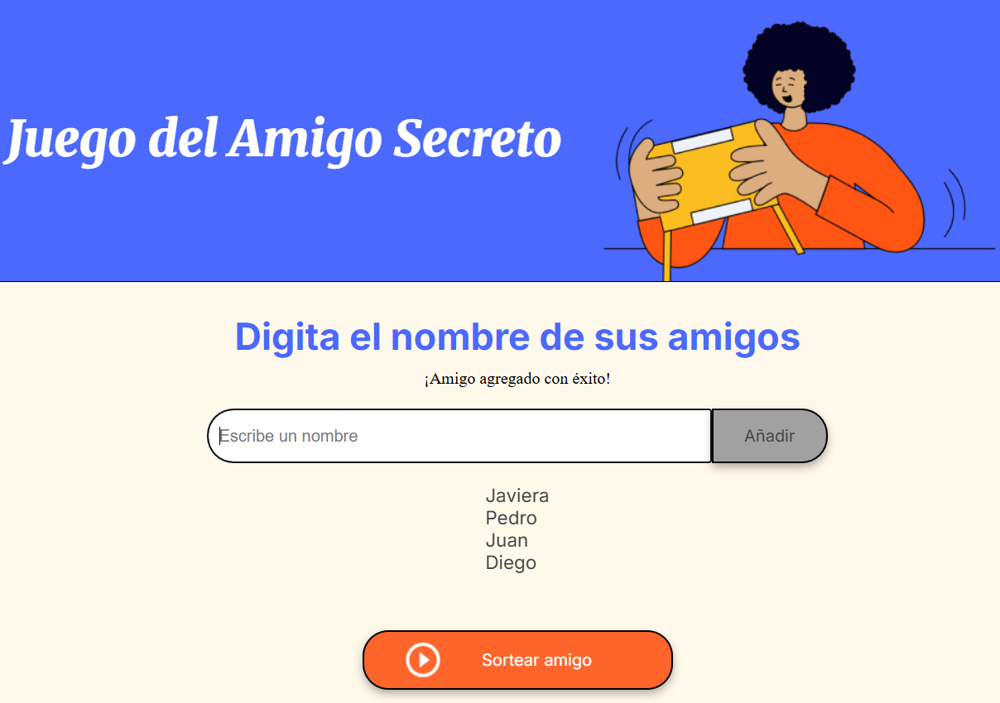
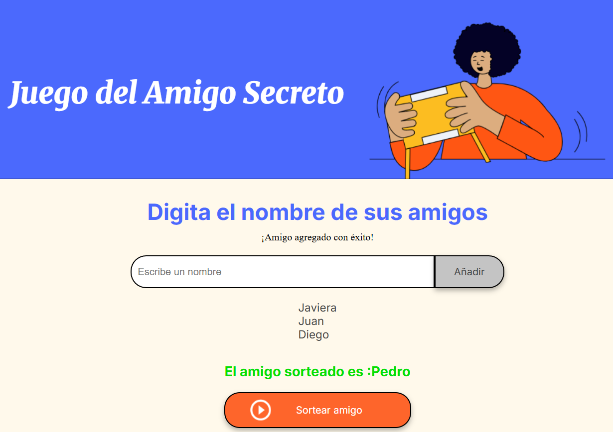
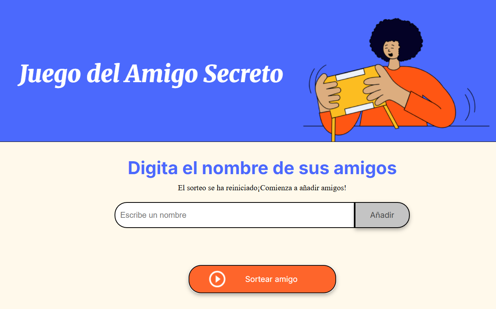

# Juego del Amigo Secreto 🎁🎉

  El **Juego del amigo secreto** es una pagina web desarrollada como parte del desafío de formación para Principiantes de Programación en el Grupo **G8 de Alura Latam**.
  
  El _objetivo_ es permitir a los usuarios ingresar nombres de amigos a una lista y realizar un sorteo aleatorio para determinar quién será el **"Amigo Secreto"**.

---

## Caracteristicas 🚀

-**Agrega amigos a una lista dinámica**

-**Validación de entradas**: Se asegura que los nombres no esten duplicados y que no se ingrese caracteres especiales. Enviando un mensaje cuando este sucede.

-**Sorteo aleatorio**: Se escoge un amigo al azar de la lista.

-**Reinicio automático**: Una vez que el sorteo finaliza, el sitema se reinicia para comienze de nuevo.

-**Interfaz accesible y fácil de usar.**

---
## Tecnologías utilizadas 

1.**HTML5**

2.**CSS3**

3.**JavaScript**

---

## Instalación y ejecución

Sigue los siguientes pasos para clonar y ejecutar el proyecto localmente:

1. Clona el repositorio

```bash
git clone https://github.com/joviscarcamo/Challenge_AmigoSecreto_Alura.git
```

2. Abre el archivo index.html en tu navegador favorito.

>**Nota**: No se necesita instalar ningun programa adicional ya que es un proyecto puramente basado en HTML,CSS y JavaScript.
--- 
## Uso

Ingresa el nombre de un amigo en el campo de texto.

Haz click en el botón **"Añadir"** para agregarlo a la lista.

Repite el proceso hasta completar la lista.

Haz click en **"Sortear Amigo"** para escoger un nombre al azar.

Al finalizar el sorteo,el sistema se reiniciara automaticamente para permitirte comenzar de nuevo.

---

## Capturas de Pantalla

A continuación se muestra una serie de capturas de pantalla mostrando la interfaz del juego.

**Pantalla Principal**


**Lista con nombres de amigos**

En la captura se puede observar que cuando se ingtresa un nombre de amigo válido se genera un mensaje ¡Amigo agregado con éxito!, en el caso contrario, recibiría mensajes tales como: 

-**"El nombre ya esta en la lista"**:Cuando existe nombres duplicados.

-**"El nombre solo debe contener letras"**: Cuando se ingresa un caracter especial no admitido.

-**"Por favor, Ingresa un nombre"**: Cuando se clickea el botón añadir, pero no se ha ingresado ningún nombre.



**Sorteo**

Como se observa en la captura al clickear el botón Sortear Amigo aparece el mensaje:

-**"El amigo sorteado es: ---"**



**Reinicio Sorteo**

Despúes que la lista de amigos queda vacía, la página realiza un reinicio automático enviando el siguiente mensaje:

-"**El sorteo se ha reiniciado ¡Comienza a añadir amigos!"**




---
## Autor

-**Johana Cárcamo**. Implementación de la lógica en JavaScript.

-**Alura Latam-G8 ONE**- Entrega del diseño base en HTML y CSS.
Proyecto desarrollado como parte del programa del curso G8 ONE- Alura Latam.

---
## Licencia

Este proyecto es de código abierto y puede ser utilizado con fines educativos.

**¡Espero que este proyecto te sea útil y te diviertas usándolo!** 🎉


